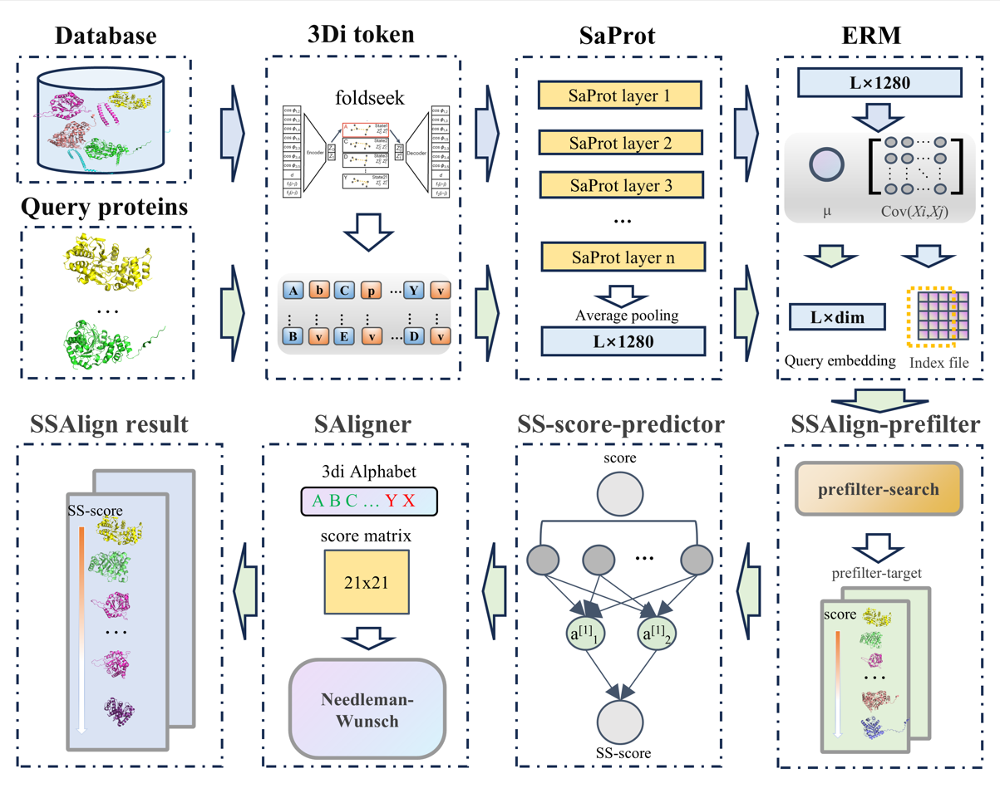
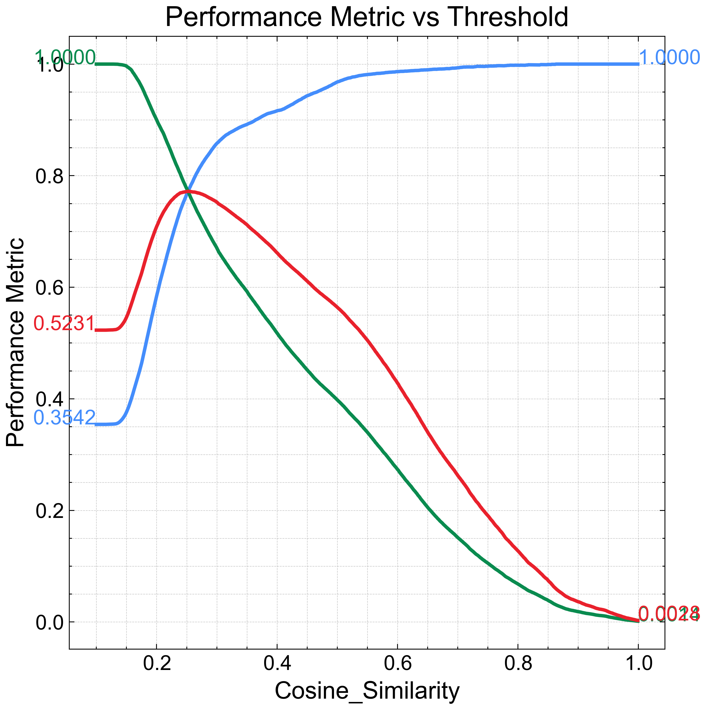

# SSAlign

SSAlign is an ultra-fast and highly sensitive protein search tool designed to retrieve the most similar proteins from large databases. It leverages protein language models to represent sequence and structure information, and supports multi-GPU and multi-process execution. SSAlign performs batched searches for many query proteins using a two-stage alignment pipeline (prefilter + alignment refinement). In our benchmarks (vs. Foldseek and TM-align), SSAlign achieves strong sensitivity with much higher throughput.

## Publications

> https://www.biorxiv.org/content/10.1101/2025.07.03.662911v1

## Overview



## Features

* **Two-stage search**: fast prefilter + refinement alignment.
* **Scales to very large databases** with multi-GPU / multi-process acceleration.
* **Benchmarks included**: SwissProt, SCOPe40, AFDB50.

## Table of Contents

* [Installation](#installation)
* [Quick Start](#quick-start)

  * [Web Server](#web-server)
  * [Prepare Files for Local Runs](#prepare-files-for-local-runs)
  * [One-Command Runs](#one-command-runs)
* [Important Search Parameters](#important-search-parameters)
* [Benchmark Environment](#benchmark-environment)
* [Numba Compiler (SAligner)](#numba-compiler-saligner)
* [Multi-GPU Faiss Sharding](#multi-gpu-faiss-sharding)
* [Prefilter Threshold](#prefilter-threshold)
* [Benchmark](#benchmark)
  * 
  * [SwissProt Benchmark](#swissprot-benchmark)
  * [SCOPe40 Benchmark](#scope40-benchmark)
  * [AFDB50 Benchmark](#afdb50-benchmark)
  * [Dataset Download](#dataset-download)

---

## Installation

### Clone the Repository

```bash
git clone https://github.com/ISYSLAB-HUST/SSAlign.git
cd SSAlign
```

### Create and Activate Environment

```bash
conda env create -f env.yml
conda activate SSAlign
```

---

## Quick Start

### Web Server

* Submit jobs directly at: `http://bioinfo.isyslab.info/ssalign/search/`

### Prepare Files for Local Runs

Download or generate required intermediate files:

1. **Protein structures**

   * SwissProt structures → `pdbData/pdb/SwissProt`
   * SCOPe40 structures → `pdbData/pdb/SCOPe40`

2. **Models**

   * Download `SaProt_650M_AF2.pt` from `https://huggingface.co/westlake-repl/SaProt_650M_AF2`
   * Place it under: `models/`

3. **Foldseek databases (optional)**

   * Download Foldseek databases for SCOPe40 / SwissProt / AFDB50 and place under:

     * `models/foldseekDB`
   * References:

     * `http://bioinfo.isyslab.info/ssalign/download/section/ssalign/`
     * `https://github.com/steineggerlab/foldseek`

4. **SSAlign databases (recommended for local runs)**

   * Place downloaded SSAlignDB under:

     * `models/SSAlignDB/SwissProt` *(folder name follows your repo scripts)*

5. **Generate databases locally (alternative)**

   * SwissProt / SCOPe40:

     * `SwissProt/processDB.py`
     * `SCOPe40/processDB.py`
   * AFDB50:

     * `AFDB50/build_indexDB.py`
     * `AFDB50/build_faiss.py`
     * `AFDB50/AFDB50fasta_whiteing.py`

### One-Command Runs
* To run `run_SSAlign.py` and search directly within the corresponding database by specifying the `--db` parameter.Or you can:
  * Run SSAlign search on SwissProt:`SiwssPort/SiwssPort_SSAlign.py`
  * Run SSAlign search on SCOPe40:`SCOPe40/SCOPe40_SSAlign.py`
  * Run SSAlign search on AFDB50:`AFDB50/AFDB50_SSAlign.py`

---

## Important Search Parameters

| Option                   | Description                                                                                                                                                                           |
| ------------------------ | ------------------------------------------------------------------------------------------------------------------------------------------------------------------------------------- |
| `--db`                   | Select the database to search. Currently supported: afdb50 | scope40 | swissprot                                                                                                                                  |
| `--querypdbs`     | Number of candidates selected in SSAlign-prefilter stage (default: `2000`). Larger → slower.                                                                                          |
| `--prefilter_target`  | Number of candidates to retain in the prefilter stage(default: `2000`). Must be ≤ `prefilter_target` and ≤ `max_target`. May depend on index type. |
| `--prefilter_threshold`           | Score cutoff for triggering SAligner re-ranking in the prefilter stage(default: `0.3`).  .                                                                         |
| `--max_target`        |Maximum number of final results returned by the tool (default: `1000`).                                                                                                                                              |
| `--mode`        | Operation mode: 0 - prefilter only; 1 - full two-stage pipeline.                                                                                                                                              |
| `--prefilter_mode`        | Execute the FAISS-based prefilter stage on CPU or GPU (sharded across multiple GPUs)(default: `cpu`,choices=["cpu", "gpu"]). .                                                                                                                                              |
| `--out_dir`        | Output directory for saving search results.                                                                                                                                              |
| `--nproc`        | Number of parallel threads for the SAligner stage (default: `64`).                                                                                                                                              |
| `--cuda_device`        | CUDA device identifier for running the SaProt model (e.g., 'cuda:0').                                                                                                                                              |
| `--batch_size`        | Batch size parameter for the SaProt model inference (default: `20`).                                                                                                                                              |

---

## Benchmark Environment

All tests were run on a server with:

* **CPU**: Intel Xeon Gold 6133 × 2 (40 cores / 80 threads), 2.50–3.00 GHz
* **GPU**: NVIDIA RTX A6000 48GB × 3
* **Memory**: 256GB


---

## Numba Compiler (SAligner)

SAligner uses **Numba** to accelerate a **Needleman–Wunsch** alignment over 3Di sequences. The compiled version significantly speeds up alignment.

### Compile `pair_align.py`

```python
from numba.pycc import CC
from pair_align import saligner

cc = CC('saligner')
cc.verbose = True
cc.export('saligner', 'i8(string, string)')(saligner)

if __name__ == '__main__':
    cc.compile()
```

The compiled output is:
`SAligner/saligner.cpython-310-x86_64-linux-gnu.so.so`

### Example Usage

```python
from saligner import saligner

seq1 = "VGTSLSVLIRAELGHPGALI"
seq2 = "GDDQIYNVIVTAHAFVMIFFMVMPIMI"
saligner_score = saligner(seq1, seq2)
```

### Timing Example (length=1000)

| Non-accelerated SAligner | Biopython | SAligner |
| ------------------------ | --------- | -------- |
| 0.4862s                  | 0.0066s   | 0.00536s |

---

## Multi-GPU Faiss Sharding

Faiss supports sharding large indices across multiple GPUs so that combined GPU memory can hold the index.

```python
import faiss

index = faiss.read_index(faiss_index_file)

gpu_resources = [faiss.StandardGpuResources() for _ in range(2)]
co = faiss.GpuMultipleClonerOptions()
co.shard = True

index = faiss.index_cpu_to_gpu_multiple_py(gpu_resources, index, co)
```

---

## Prefilter Threshold
The `prefilter_threshold` determines the number of results that can be directly returned in the SSAlign-prefilter stage without requiring further filtering by SAligner. For the IndexFlatIP index, we conducted detailed tests across different dimensions. The figure below shows the relationship between accuracy (TM-Score >= 0.5) and recall under different thresholds. A threshold that is too low may lead to a decrease in accuracy, while a threshold that is too high may result in excessive time consumption during the SAligner stage.The figure below shows the impact of selecting different `prefilter_threshold` values on accuracy and recall when the dimensionality is 1280 and the `prefilter_target = 2000`.
<div align="center">
  
</div>
In our benchmark, the selected thresholds are shown in the table below.

| dim | 1280 | 512 |
| --- | --- | --- | 
| **prefilter_threshold** | 0.2 | 0.3 |


---

## Benchmark

Benchmark intermediates can be downloaded from:
`http://bioinfo.isyslab.info/ssalign/download/section/ssalign/`

### SwissProt Benchmark

1. TM-align results:

   * `utils.execTMalign.exec_tmalign_SwissProt`
   * output → `../benchmarkData/SwissProt/tmalign`
2. Foldseek results:

   * `utils.execFoldseek.exec_foldseek_easy_search_para_SwissProt`
   * output → `../benchmarkData/SwissProt/foldseek`
3. SSAlign / SSAlign-prefilter:

   * `SwissProt.benchmark_SSAlign_result.main`
   * output → `../benchmarkData/SwissProt/SSAlign/SVD{dim}/ssalign`
     and `../benchmarkData/SwissProt/SSAlign/SVD{dim}/ssalign_prefilter`
4. Overlap comparison:

   * `SwissProt/benchmark_overlap.py`
   * output → `../benchmarkData/SwissProt/benchmark`
5. Cumulative score prep (NPZ):

   * `SwissProt/benchmark_cumsum_score.py`
   * output → `../benchmarkData/SwissProt/cumsumNpz`
6. Plot figures:

   * `SwissProt/benchmark_plot.py`
   * output → `../benchmarkData/SwissProt/benchmark`
7. Recommended `prefilter_threshold` figure:

   * `SwissProt/cosine_threshold.py`
8. SS-Score trainer:

   * `SwissProt/LinearModel.py`

### SCOPe40 Benchmark

1. TM-align:

   * `utils.execTMalign.exec_tmalign_SCOPe40`
   * output → `../benchmarkData/SCOPe40/tmalign`
2. Foldseek:

   * `utils.execFoldseek.exec_foldseek_easy_search_para_SCOPe40`
   * output → `../benchmarkData/SCOPe40/foldseek`
3. SSAlign / SSAlign-prefilter:

   * `SCOPe40.benchmark_SSAlign_result.main`
   * output → `../benchmarkData/SCOPe40/SSAlign/SVD{dim}/ssalign`
     and `../benchmarkData/SCOPe40/SSAlign/SVD{dim}/ssalign_prefilter`
4. Add SCOPe family/superfamily/folderror:

   * `SCOPe40/benckmark_add_lookup.py`
   * output → `../benchmarkData/SCOPe40/tmalign/new05`
     and `../benchmarkData/SCOPe40/foldseek/new05`
     and `../benchmarkData/SCOPe40/SSAlign/SVD{dim}/new05`
5. Prepare NPZ:

   * `SCOPe40/benchmark_cumsum_PR_FP.py`
   * output → `../benchmarkData/SCOPe40/cumsumNpz`
6. Plot figures:

   * `SCOPe40/benchmark_plot.py`
   * output → `../benchmarkData/SCOPe40/benchmark`
7. Recommended `prefilter_threshold`:

   * `SCOPe40/cosine_threshold.py`
8. SS-Score trainer:

   * `SCOPe40/LinearModel.py`

### AFDB50 Benchmark

1. SAligner time benchmark:

   * `AFDB50/SAligner_timebenchmark.py`
2. Foldseek time benchmark:

   * `AFDB50/foldseek_time_benckmark.sh`
   * logs → `AFDB50/logs/foldseek_processing_times.log`
   * raw results → `../benchmarkData/AFDB50/foldseek/timebenchmark`
3. SSAlign time benchmark:

   * `AFDB50/AFDB50_SSAlign_timebenchmark.py`
   * raw results → `../benchmarkData/AFDB50/SSAlign/SVD{dim}/timebenchmark`
   * example command:

```bash
python AFDB50_SSAlign_timebechmark.py \
  --query_file_list_file .filenames_without_extension.txt \
  --faiss_index ../model/SSAlignDB/AFDB50/afdb50_512_IndexFlatIP_faiss.faiss \
  --dim 512 \
  --mode 1 \
  --prefilter_target 2000 \
  --prefilter_mode cpu \
  --prefilter_threshold 0.3 \
  --max_target 1000 \
  --out_dir ../benchmarkData/AFDB50/SSAlign/SVD512/timebenchmark \
  --cuda_device cuda:1 \
  --batch_size 20 \
  --nproc 64
```

| tool | Execution Time on CPUs(Seconds) | Execution Time on GPUs(Seconds) |
| --- |----------------|----------------|
| foldseek easy-search | 325081s        | \  |
| SSAlign(preload)  |  633.53 | * |
| SSAlign-prefilter  |  1621.5 |  * |
| SSAlign-SAligner  |  1070.84|  * |
| SSAlign |  2715.98s | * |

4. Generate SSAlign-prefilter results:

   * run with: `--mode 0 --prefilter_target 2000 --max_target 2000`
5. Download structure files for both tools:

   * `AFDB50/AFDB50_SSAlign_timebechmark.py`
6. Add TM-align scores:

   * `AFDB50/add_TMalign.py`
   * output → `../benchmarkData/AFDB50/`
7. Prepare NPZ for plotting:

   * `AFDB50/afdb50_benchmark_cumsum_score.py`
   * output → `../benchmarkData/AFDB50/cumsumNpz`
8. Plot cumulative curves:

   * `AFDB50/afdb50_benchmark_plot.py`
9. (Optional) Compare statistics tables:

   * `AFDB50/compare_7tools_stats_100.py` → CSV
   * `AFDB50/test_100_queries.py` → summary tables

| tool                   | mean_total_rows | mean_tm_non_na_rows | mean_avg_tmscore | mean_sum_tmscore | mean_avg_RMSD | mean_sum_RMSD | SUM(sum_tmscore) | SUM(sum_RMSD) | overall_avg_tmscore | overall_avg_RMSD |
| ---------------------- | --------------: | ------------------: | ---------------: | ---------------: | ------------: | ------------: | ---------------: | ------------: | ------------------: | ---------------: |
| foldseek               |         1160.77 |             1072.70 |             0.70 |           751.13 |          2.58 |       2750.98 |         75112.60 |     275097.63 |                0.70 |             2.56 |
| ssalign                |         1000.00 |              929.45 |             0.77 |           719.12 |          2.46 |       2283.56 |         71911.83 |     228355.67 |                0.77 |             2.46 |
| ssalign_prefilter_2000 |         2000.00 |             1852.97 |             0.71 |          1305.91 |          2.59 |       4802.82 |        130591.18 |     480282.11 |                0.70 |             2.59 |

---
| tool                                   | mean_total_rows | mean_tm_non_na_rows | mean_avg_tmscore | mean_sum_tmscore | mean_avg_RMSD | mean_sum_RMSD | SUM(sum_tmscore) | SUM(sum_RMSD) | overall_avg_tmscore | overall_avg_RMSD |
| -------------------------------------- | --------------: | ------------------: | ---------------: | ---------------: | ------------: | ------------: | ---------------: | ------------: | ------------------: | ---------------: |
| foldseek_except_ssalign                |          753.25 |              694.17 |             0.65 |           446.53 |          2.69 |       1922.34 |         44653.13 |     192234.39 |                0.64 |             2.77 |
| ssalign_except_foldseek                |          592.48 |              550.92 |             0.76 |           410.55 |          2.52 |       1454.92 |         41055.43 |     145492.43 |                0.75 |             2.64 |
| foldseek_except_ssalign_prefilter_2000 |          527.38 |              485.68 |             0.63 |           295.55 |          2.76 |       1431.70 |         29555.28 |     143170.23 |                0.61 |             2.95 |
| ssalign_prefilter_2000_except_foldseek |         1366.61 |             1265.95 |             0.68 |           850.34 |          2.68 |       3483.55 |         85033.86 |     348354.71 |                0.67 |             2.75 |

---

### Dataset Download
* Download SSAlignDB and benchmark intermediates at: `http://bioinfo.isyslab.info/ssalign/download/section/ssalign/`

### SSAlign accurately detects simple fold proteins missed by Foldseek
AMPs example,you can see those pdb file in ```pdbData/specialpdb``` ,those search result you can also find in benchmark


---


