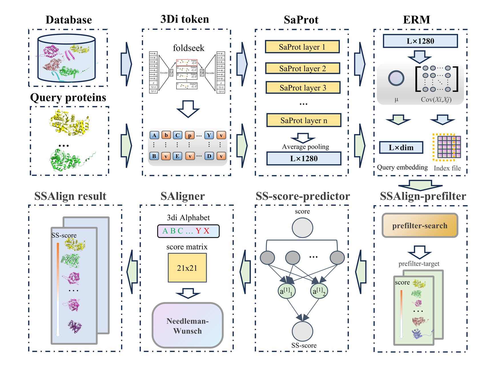

# SSAlign


SSAlign is an ultra-fast and highly sensitive protein search tool capable of identifying the most similar proteins from large databases. By leveraging protein language models to deeply represent the amino acid sequences and structural information of proteins, and utilizing multi-GPU and multi-process capabilities, SSAlign achieves rapid simultaneous searches for multiple query proteins through a two-stage efficient alignment process. Through extensive comparisons with existing tools such as Foldseek and TM-align, we have demonstrated that SSAlign outperforms these methods in both speed and sensitivity, even surpassing Foldseek by 2 to 3 orders of magnitude, while delivering results comparable to state-of-the-art structural alignment tools.

## Publications

文章地址
# Table of Contents
- [Overview](#overview)
- [Installation](#installation)
  - [Clone the Repository](#clone-the-repository)
- [Quick start](#quick-start)
  - [Important search parameters](#important-search-parameters)
  - [System Requirements](#system-requirements)
- [Benckamrk](#benckmark)
  - [Time Benckmark](#time-benckmark)
  - [Performance Benckmark](#performance-benckmark)
- [Database](#database)
- [Numba Compliler](#numba-compliler)
- [Index Select](#index-select)
  - [Index File Size and Search Time](#index-file-size-and-search-time)
  - [Prefilter_Threshold](#prefilter-threshold)


## Overview


## Installation
### Clone the Repository

```shell
git clone https://github.com/ISYSLAB-HUST/SSAlign.git
cd SSAlign
```

### Create and Activate Environment

```shell
conda env create -f environment.yml
conda activate SSAlign
```

## Quick start

Save the names of all proteins to be queried into a file in the following format:

```shell
AF-A2SSV1-F1-model_v4
AF-P54855-F1-model_v4
AF-Q1WT04-F1-model_v4
AF-Q7VHY7-F1-model_v4
AF-Q836J6-F1-model_v4
AF-P18637-F1-model_v4
AF-Q5R6G8-F1-model_v4
```

We provide a script for searching within the **afdb50** database. For other databases, simply replace the database file path in the script.

```shell
python ssalign_batch.py --query_file_list_file filenames_without_extension.txt --dim 1280
 --prefilter_target 2000 --prefilter_threshold 500 --max_target 1000 --num_processes 64 --num_gpus 2

```

#### Important search parameters

| Option              | Description |
| --- | --- |
| --query_file_list_file | A file that includes the names of all proteins to be queried. |
| --dim | Query dimension.Lower dimensions can reduce memory consumption. We have constructed vector libraries in five dimensions: [1280, 512, 256, 128, 64]. The default dimension is 1280. |
| --prefilter_target | Number of candidates selected in the SSAlign-prefilter stage .Increasing this value will increase time consumption. The default is 2000. |
| --prefilter_threshold | Number of final target proteins selected in the SSAlign-prefilter stage .This value should be smaller than both prefilter_target and max_target. The default is 500. Note that this value may vary depending on the type of index file. Refer to the "Index Select" section for details. |
| --max_target | Number of final target proteins returned by SSAlign for each query protein .This value should be smaller than the number selected in the SSAlign-prefilter stage. The default is 1000. |
| --num_processes | Number of processes used during SSAlign execution .The default is 64. |
| --num_gpus | Number of GPUs used during SSAlign execution. SSAlign also supports execution in environments without GPUs. The default is 2. |

### System Requirements

All our testing work was conducted on a server with the following configuration:

- CPU: Intel Xeon Gold 6133 (2 sockets, 40 cores, 80 threads).Base 2.50 GHz, max turbo 3.00 GHz.
  
- GPU：NVIDIA RTX A6000 48GB × 2
  
- Memory：256GB
  

Referring to the memory consumption in the "benchmark," you can almost run SSAlign on a personal PC with sufficient memory to perform searches on a database of tens of millions of entries. Although the lack of a GPU may reduce speed, SSAlign still supports such operations.

## Benckmark

We provide all the raw data for the benckmark, which you can download at 【原始资料的链接】.

### Time Benckmark

The code can be referenced from afdb50/*，

We randomly selected 1,000 query proteins(filenames_without_extension.txt) and performed searches in the afdb50 database to compare the speed of Foldseek and SSAlign, Both were run using default parameters.as shown in the table below:

| tool | cost time(seconds) | cost memory(GB) |
| --- | --- | --- |
| foldseek easy-search | 325081 | 42 GB |
| SSAlign --dim 1280 | 420.34271216392517 | 26GB |
| SSAlign --dim 512 | 405.3091769218445 | 25GB |
| SSAlign --dim 256 | 405.3091769218445 | 25GB |
| SSAlign --dim 128 | 400.7877838611603 | 25GB |
| SSAlign --dim 64 | 400.1236891379811 | 25GB |

For more details, you can refer to the paper/supplementary materials: 【原始资料的链接/论文地址】.

### Performance Benckmark

The code can be referenced from SiwssProt/* and Scope40/*.

The following two figures demonstrate the superiority of SSAlign on the SwissProt and SCOPe40 datasets.For more details, you can refer to the paper/supplementary materials: 【原始资料的链接/论文地址】.
<div align="center">
  
</div>
The benchmark on the Swiss-Prot dataset includes 100 query proteins and 542,378 database entries. Show the results of the five methods, sorted by the avg_tmscore obtained from TM-align, with the cumulative avg_tmscore and RMSD plotted against the top-ranked protein pairs.
<div align="center">
  
</div>
All-to-many search test on the SCOPe40 dataset. For identification at the family and superfamily levels, true positives (TP) are defined as proteins belonging to the same family or the same superfamily but different families, respectively. Hits from different folds are considered false positives (FP).

## Database

We have provided processing results for three protein databases: Swiss-Prot, SCOPe40, and afdb50.For example,

```shell
# Use the functionality provided by Foldseek to create a FASTA file of 3Di sequences for proteins in the afdb50 database.
foldseek createsubdb accession_list afdb50 afdb50_subset --id-mode 1
foldseek convert2fasta afdb50_subset afdb50_subset.fasta
# Use the functionality provided by Foldseek to create a FASTA file of Amino acid sequence for proteins in the afdb50 database.
foldseek createsubdb accession_list afdb50_ss afdb50_subset_ss --id-mode 1
foldseek lndb afdb50_h afdb50_subset_ss_h
foldseek convert2fasta afdb50_subset_ss afdb50_ss.fasta
```

Use `build_indexDB.py` to construct the database from the FASTA file.

- ssalign_afdb50_combined_seq
  
- ssalign_afdb50_combined_seq.index
  
- ssalign_afdb50_combined_seq.lookup
  

The construction of the Faiss index file relies on `whitening/build_faiss_Index.py`. You can choose different types of Faiss indexes. For specific differences, please refer to the "Index Select" section. We provide two types of indexes: **IndexFlatIP** and **IndexFlatPQ**,including  five dimensions: 1280, 512, 256, 128, and 64.

- afdb50_1280_IndexFlatIP_faiss.faiss
  
- afdb50_1280_IVFPQ_faiss.faiss
  
- ...
  

## Numba Compliler

SAligner utilizes the **Numba compiler** to implement the **Needleman-Wunsch algorithm** and applies it to the alignment of 3Di sequences. Thanks to the Numba compiler, the speed has improved by ten times compared to the original implementation.

Scripts to Compile `pair_align.py` .

```python
from numba.pycc import CC
from pair_align import saligner
cc = CC('saligner')  
cc.verbose = True  
cc.export('saligner', 'i8(string, string)')(saligner)
if __name__ == '__main__':
    cc.compile()
```

The compiled result is the `SAligner/saligner.cpython-310-x86_64-linux-gnu.so.so` file.

Example: Directly Using the Accelerated SAligner

```python
from saligner import saligner 
seq1 = "VGTSLSVLIRAELGHPGALI"  
seq2 = "GDDQIYNVIVTAHAFVMIFFMVMPIMI" 
saligner_score = saligner(seq1, seq2)
```

Time Consumption for Aligning Two 3Di Sequences of Length 1000.

| Non-accelerated SAligner | Biopython | SAligner |
| --- | --- | --- |
| 0.48620128631591797s | 0.006602048873901367s | 0.005364656448364258s |

## Index Select

We use the open-source FAISS library from Facebook to build vectorized indexes, which significantly reduces memory consumption and improves speed. FAISS supports various types of indexes, and users should choose the appropriate one based on their data size and hardware resources. For the afdb50 database, we provide two types of indexes: IndexFlatI and IndexIVFPQ, allowing users to select based on their available resources. For details on how to construct these indexes, please refer to the "database" section.

### Index File Size and Search Time

- **IndexFlatIP**:
  
  This is a simple, exact search index.The size of the index file is proportional to the number of vectors and their dimensionality.For example, for a database with 1 million vectors of 1280 dimensions (float32), the index size would be approximately:
  
  ```mathml
  1,000,000 vectors * 1280 dimensions * 4 bytes/float32 ≈ 4.8 GB
  ```
  

- **IndexIVFPQ**:
  
  This is an approximate search index that uses product quantization to reduce memory usage.The index size is significantly smaller than IndexFlatIP due to compression.For the same database (1 million vectors of 1280 dimensions), the index size might range from **500 MB to 1 GB**, depending on the compression parameters.
  

We tested the time consumption for searching the top 2000 results for 1000 query vectors in the afdb50 database (53,665,860 proteins) under different dimensions and index types. The results are shown in the table below:

| Index Type | Dimensions | File Size | Loading Time(CPU/GPU) | Search Time(CPU/GPU) |
| --- | --- | --- | --- | --- |
| IndexFlatIP | 512 | 103GB | 465.2(/) s | 1192.3(/)s |
| IndexFlatIP | 256 | 52GB | 194.6(216)s | 594.4(2)s |
| IndexFlatIP | 128 | 32GB | 134.2(149)s | 326.7(1.7)s |
| IndexFlatIP | 64  | 13GB | 65.1(75.1)s | 194.1(1.5)s |
| IndexIVFPQ | [1280,512,256,128,64] | 1.2GB~1.3GB | 6.3(7.1)s | 0.5(0.5)s |

Thanks to Faiss's support for multi-GPU parallel computing, we can distribute larger index files across multiple GPUs, ensuring that the combined GPU memory exceeds the size of the index file. The specific approach is as follows: /

```shell
import faiss
# load index file
index = faiss.read_index(faiss_index_file)
# use 2 GPU
gpu_resources = [faiss.StandardGpuResources() for _ in range(2)]  
co = faiss.GpuMultipleClonerOptions()
co.shard = True  
# move index to GPU
index = faiss.index_cpu_to_gpu_multiple_py(gpu_resources, index, co)
```

### Prefilter Threshold
The `prefilter_threshold` determines the number of results that can be directly returned in the SSAlign-prefilter stage without requiring further filtering by SAligner. For the IndexFlatIP index, we conducted detailed tests across different dimensions. The figure below shows the relationship between accuracy (TM-Score >= 0.5) and recall under different thresholds. A threshold that is too low may lead to a decrease in accuracy, while a threshold that is too high may result in excessive time consumption during the SAligner stage.The figure below shows the impact of selecting different `prefilter_threshold` values on accuracy and recall when the dimensionality is 1280 and the `prefilter_target = 2000`.
<div align="center">
  
</div>
In our benchmark, the selected thresholds are shown in the table below.

| dim | 1280 | 512 | 256 | 128 | 64  |
| --- | --- | --- | --- | --- | --- |
| **prefilter_threshold** | 0.2 | 0.3 | 0.45 | 0.6 | 0.7 |

For the **IndexIVFPQ** index, with `prefilter_target=2000`, we recommend using a threshold of **500**, which achieves a balance between speed and accuracy.
